# NBA Player Performance Analysis: 2021-2022 Playoffs

The goal of this project is to analyze the performance of NBA players during the 2021-2022 playoffs. The analysis includes data cleaning, exploration, identifying top players in key categories, predictive modeling using regression and random forest, clustering players based on their performance, and comparing the top players using advanced visualization techniques.

## Table of Contents

1. [Introduction](#introduction)
2. [Data Source](#data-source)
3. [Methodology](#methodology)
4. [Key Insights](#key-insights)
5. [Visualizations](#visualizations)
6. [Conclusion](#conclusion)
7. [Future Work](#future-work)
8. [Technical Details](#technical-details)
9. [How to Run](#how-to-run)
10. [Acknowledgments](#acknowledgments)

## Introduction

This project focuses on analyzing NBA player performance during the 2021-2022 playoffs using advanced statistical methods and visualization techniques. The objective is to derive actionable insights that NBA teams can leverage for player evaluation, scouting, and strategic decision-making.

## Data Source

The dataset used for this analysis was sourced from Kaggle: NBA Player Stats. It includes detailed player statistics from the 2021-2022 NBA playoffs.

## Visualizations

- 
- 
- 
- 
- 
- 
- 
- 
- 
- 
- 
- 
- 
- 


## Key Insights

1. **Top Performers Across Categories:**
   - **Scoring:** Luka Dončić and Giannis Antetokounmpo led the playoffs with an average of 31.7 points per game, highlighting their scoring prowess.
   - **Assists:** James Harden and Chris Paul were the top playmakers, with Harden averaging 8.6 assists per game and Paul close behind at 8.3, showcasing their critical roles in facilitating offense.
   - **Rebounding:** Giannis Antetokounmpo dominated the boards with 14.2 rebounds per game, underlining his all-around game and importance in controlling the paint.
   - **Blocks and Steals:** Jaren Jackson Jr. led in blocks, while Jimmy Butler excelled in steals, demonstrating their defensive impact.

2. **Weighted Overall Performance:**
   - The weighted scoring system identified Giannis Antetokounmpo, Luka Dončić, and Jimmy Butler as the top three overall performers. This indicates that these players were not only prolific in scoring but also contributed significantly in other areas such as assists, rebounds, and defense.

3. **Predictive Modeling:**
   - The **Random Forest model** outperformed the **Linear Regression model** in predicting points per game (PTS). The Random Forest model achieved a lower RMSE (2.29 vs. 3.80) and a higher R-squared value (0.92 vs. 0.74), suggesting that it captures the complexity of player performance better.

4. **Player Clustering and PCA Analysis:**
   - The clustering analysis categorized players into three groups: Elite Players, Key Players, and Role Players. Giannis Antetokounmpo, Luka Dončić, and other top performers were correctly identified as elite players, which aligns with their actual performance.
   - PCA visualization provided a clear separation between clusters, indicating that the selected performance metrics effectively differentiate between varying levels of player impact.

5. **Comparative Analysis:**
   - The comparison between Luka Dončić and Giannis Antetokounmpo using radar charts and bar plots revealed their different playing styles. Dončić’s higher assist rate contrasted with Antetokounmpo’s superior rebounding and defensive stats, offering insights into how each player's strengths contribute to their teams.

6. **Sensitivity Analysis:**
   - Adjusting the weights in the overall scoring system had a noticeable impact on player rankings. This highlights the importance of carefully considering the weight of each performance metric when evaluating players, as different emphasis can lead to different interpretations of player value.

## Visualizations

- 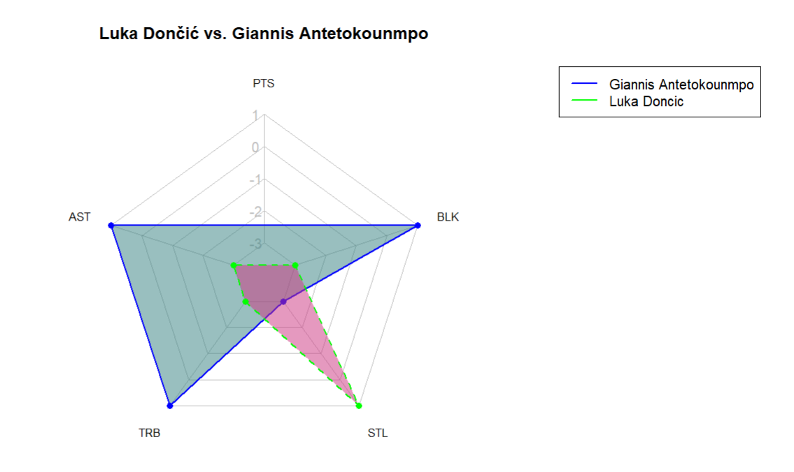
- 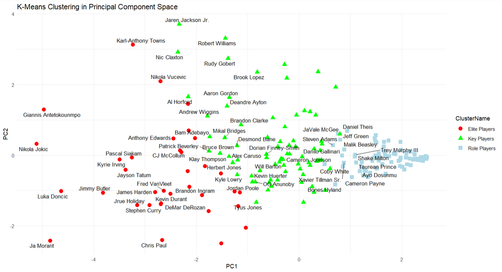
- 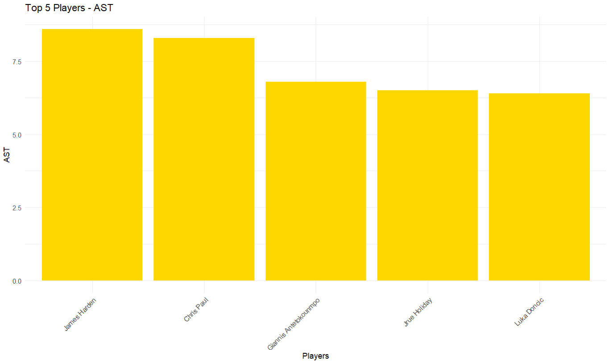
- 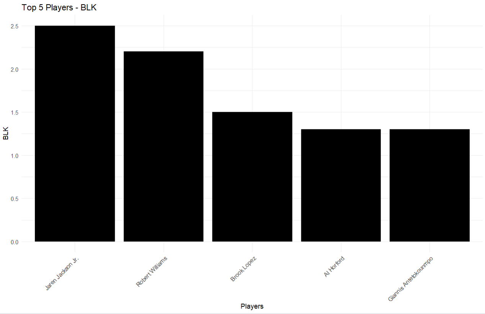
- 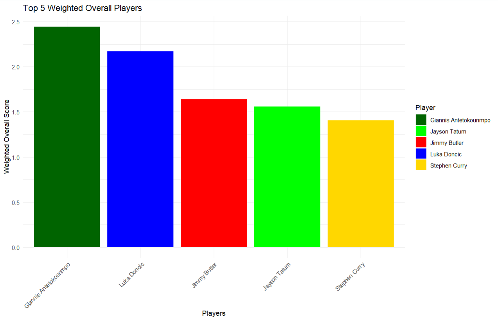
- 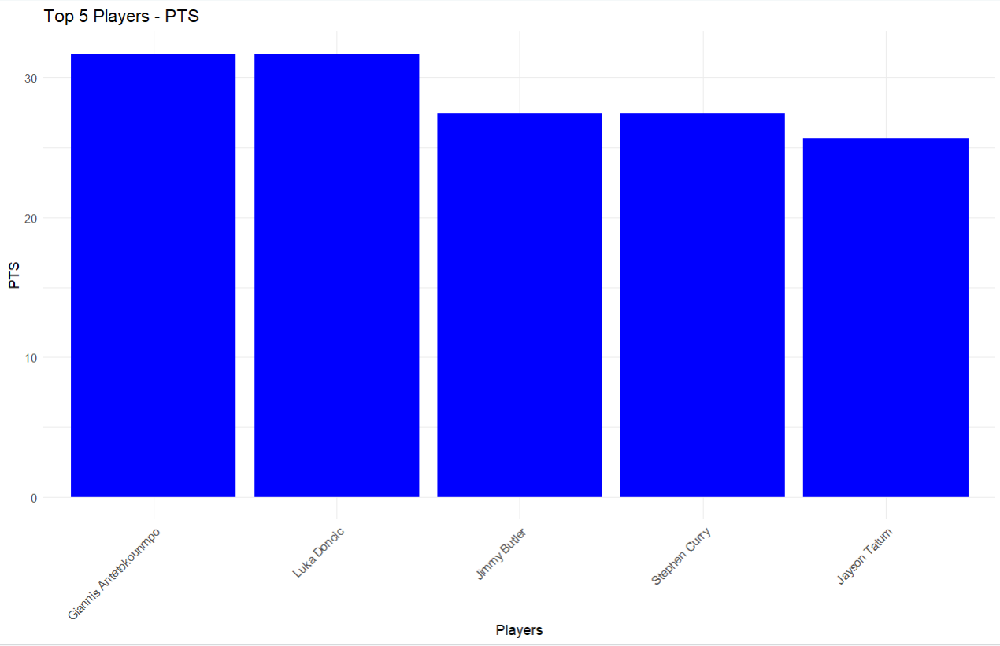
- 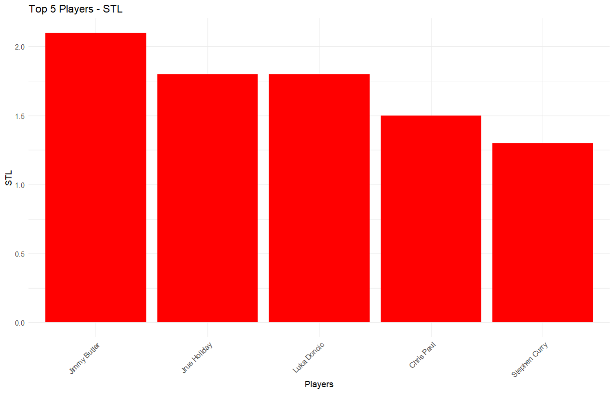
- 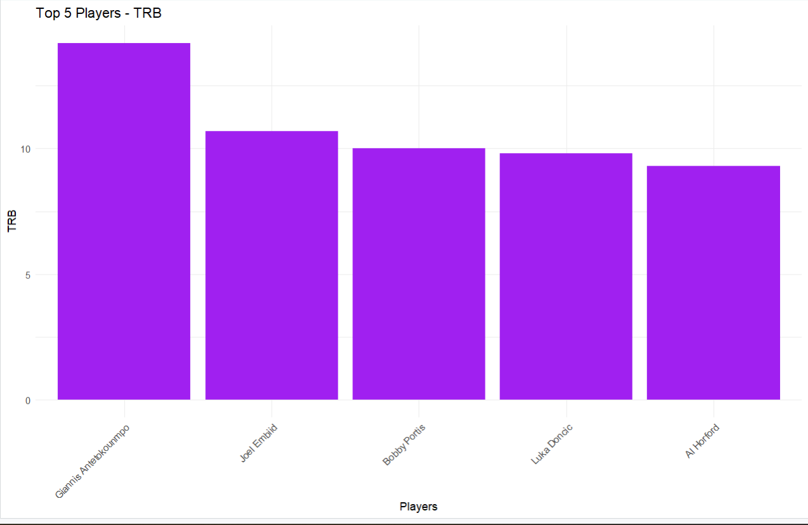
- 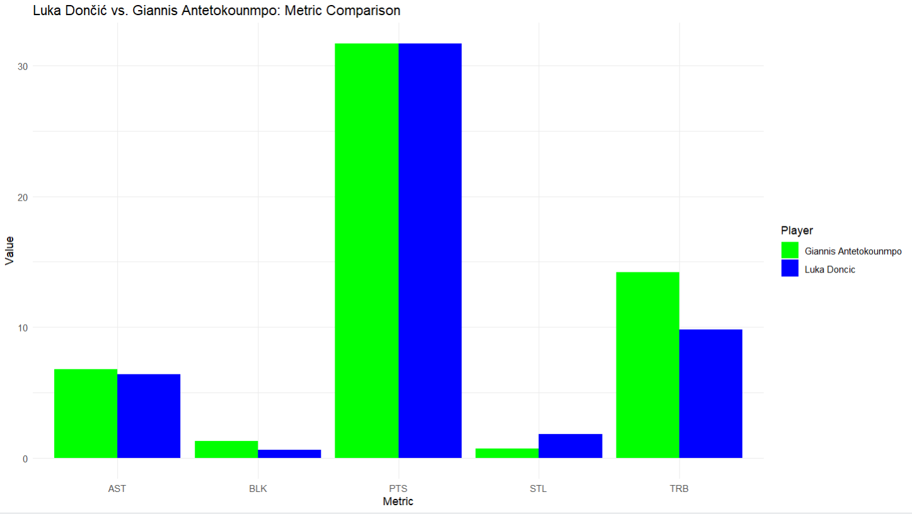
- 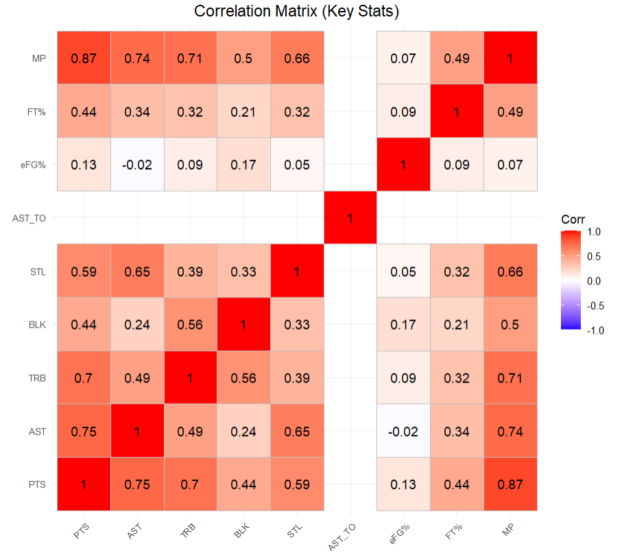
- 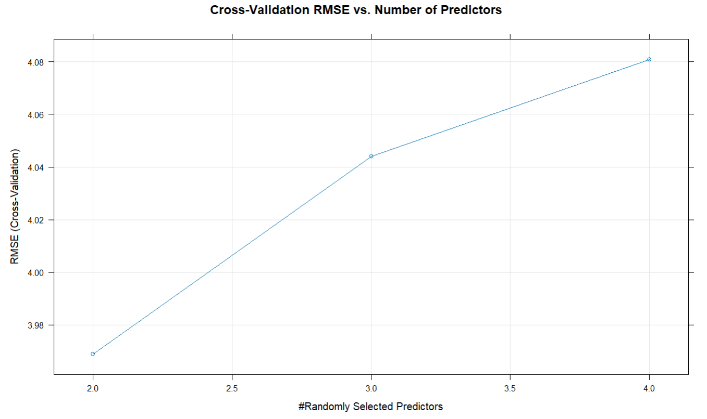
- 
- 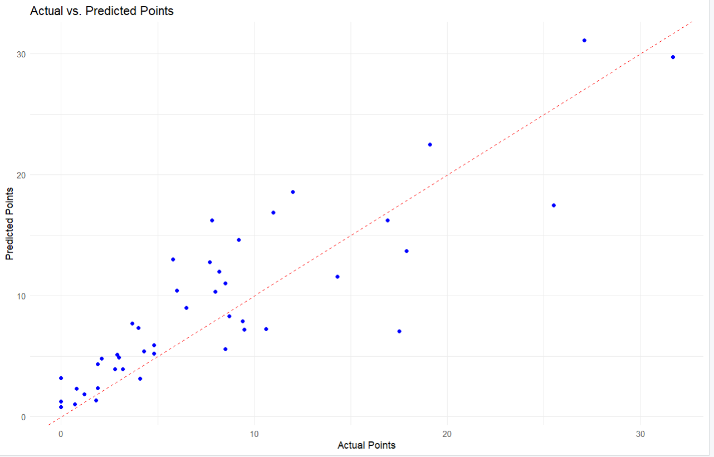
- 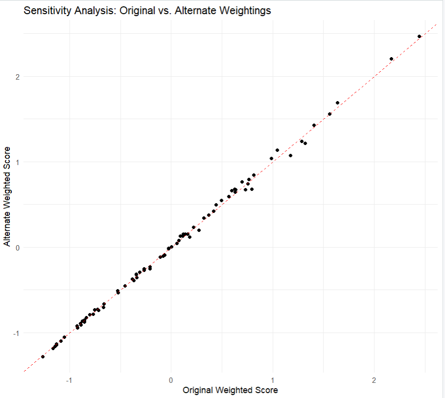

## Conclusion

The analysis successfully identified key players and provided deep insights into their performance during the 2021-2022 NBA playoffs. The weighted scoring system highlighted the top-performing players overall, while regression and random forest models provided predictive insights. Clustering and PCA helped categorize players based on performance, and the comparison between Luka Dončić and Giannis Antetokounmpo showcased differences in their playing styles.

## Future Work

1. **Expanded Metrics:** Future analysis could include advanced metrics like Player Efficiency Rating (PER) and Win Shares (WS).
2. **Predictive Analytics:** Implement predictive analytics to forecast player performance in future seasons based on historical data.
3. **Team-Level Analysis:** Extend the analysis to evaluate team performance and identify key contributors.

## Technical Details

- **R Version:** 4.4.1
- **Libraries Used:**
  - `dplyr` for data manipulation
  - `ggplot2` for data visualization
  - `readr` for data loading and parsing
  - `randomForest` for random forest modeling
  - `ggcorrplot` for correlation matrix plotting
  - `ggrepel` for text labels
  - `caret` for cross-validation
  - `tidyr` for data tidying
  - `fmsb` for radar charts

## How to Run

1. **Clone the Repository:**
   ```bash
   git clone https://github.com/yourusername/NBA-Playoffs-Analysis.git

2. Install Required Libraries:

install.packages(c("dplyr", "ggplot2", "readr", "randomForest", "ggcorrplot", "ggrepel", "caret", "tidyr", "fmsb"))

3. Run the Script:
Load the dataset into your R environment and run the provided R script NBA_Playoff_Analysis.R to generate the analysis and visualizations.

**Acknowledgments**

Data Source: Kaggle

Tools: R, ggplot2, dplyr, randomForest, ggcorrplot, ggrepel, caret, tidyr, fmsb

 

 

 


 
